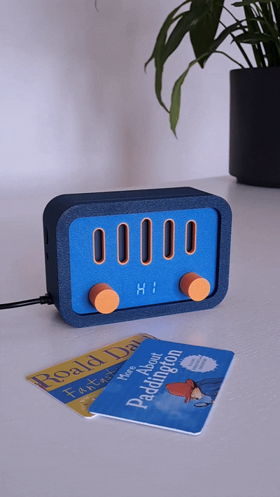

# Yaydio 📻

**No more scratched CDs!**

**Yaydio** is a portable music player designed for kids, ditching the hassle of
CDs in favor of easy-to-use keycards.

|  |  |
| ------------------------------- | --------------------------------------------------------------------------------- |
| V1                              | Battery powered V2                                                                |

## ✨ Features

- **Keycard playback:** Insert a keycard to instantly play an album.
- **Simple controls:** Play/pause, next/previous track, volume up/down.
- **Audio options:** Built-in speaker or connect headphones via the 3.5mm jack.
- **Long battery life:** Over 9 hours of play time.
- **High capacity:**
  - Up to 999 songs per album
  - Up to 9999 albums
  - Up to 65535 songs in total
  - Supports micro SD cards up to 32GB.
- **MP3 compatibility:** Plays all your favorite MP3 files.
- **Affordable & accessible:** Works with cost-effective MF S50 RFID keycards.

## 🕹️ Controls

#### Play / pause

- Inserting a keycard into the **Yaydio** will automatically start the playback.
- Press the left knob to pause or resume the playback.
- Remove the keycard to stop the playback.

#### Volume

- Turn the left knob to increase or decrease the volume.

#### Next / previous track

- Turn the right knob to skip to the next or previous track.

#### Random playback

- Press the right knob to toggle random mode on or off.
- When enabled, the **Yaydio** will pick the next track from the album at
  random.

#### Assign an album to a keycard

1. Insert the keycard into the **Yaydio**.
2. Press the left and right knobs simultaneously.
3. Turn the right knob to select the album number.
4. Press the right knob to write the album number to the keycard.

## 💿 Adding albums

#### Prepare the SD card

1. Format the SD card to FAT16 or FAT32 and name it `YAYDIO`.
2. Copy the `README.md` file onto the SD card.
3. Windows only: Download
   [DriveSort](https://www.anerty.net/software/file/DriveSort/?lang=en) and copy
   `DriveSort.exe` onto the SD card.
4. macOS only: Download [FatDriveSorter](https://fat-drive-sorter.netlify.app)
   and copy `FatDriveSorter.app` onto the SD card.

#### Copy albums to the SD card

1. Create a new folder named `0001`, where "1" represents the next album number.
2. Copy the album's songs into the folder you created.
3. Rename the first song of the album to `001.mp3`.
4. Repeat steps 1-3 for each album.

#### Sort the SD card

1. Windows only: Use `DriveSort` to sort the files alphabetically in the SD
   card's table.
   - Sort by `long name` and `ascending`.
   - Remember to press the save button.
   - You may need to sort every new folder individually and press save after
     each one.
2. macOS only: Use `FatDriveSorter` to sort the files alphabetically in the SD
   card's table.
   - Next to `Order:` select `Directories first`.
   - Tick the box next to `Case-sensitive:`.

## 🔨 Make your own

### 🧱 Parts

I've added an Amazon link for each part so you know what to look for. You'll
probably find the parts much cheaper in other stores.

- [x] 1 x Arduino Nano clone with USB-C port (pin headers not soldered on)
      ([Amazon.de](https://www.amazon.de/dp/B0D8WDV1K7))
- [x] 1 x PN532 NFC Module V3 ([Amazon.de](https://www.amazon.de/dp/B07YDG6X2V))
- [x] 1 x DY-SV5W Voice Module
      ([Amazon.de](https://www.amazon.de/dp/B09SZB73CG)) Note: Some modules
      don't come with a 1K Ohm resistor on the RXD pin. If this is the case,
      you'll have to connect D13 and the RXD pin with a 1K Ohm resistor
      ([see this](https://github.com/SnijderC/dyplayer/tree/main?tab=readme-ov-file#wiring-the-module)).
- [x] 1 x 4-digit 7-segment 0.36 inch display with TM1637 driver chip
      ([Amazon.de](https://www.amazon.de/dp/B0BCGF2R2T))
- [x] 2 x Rotary encoder with button and 15 mm D-shaft (not the KY-040 module!)
      ([Amazon.de](https://www.amazon.de/dp/B0DQKS8MBS))
- [x] 1 x Limit switch 12.8mm x 5.8mm
      ([Amazon.de](https://www.amazon.de/dp/B081TXMD4K))
- [x] 1 x Speaker 3W 8Ohms 70mm x 30mm x 15mm
      ([Amazon.de](https://amzn.eu/d/06Lj1tKR))
- [x] 1 x SM5308 battery charger module
      ([Amazon.de](https://www.amazon.de/dp/B0BGPGM4DH))
- [x] 1 x Battery 3.7V 3000mAh Li-ion 18650
      ([Amazon.de](https://www.amazon.de/dp/B0DZHL2WB6))
- [x] A bunch of 13.56 MHz MF S50 ISO14443 (Mifare Classic) RFID keycards
      ([Amazon.de](https://www.amazon.de/dp/B07TVJPTM7)) Note: If you plan on
      making multiple Yaydios sharing the same keycards, make sure you get
      keycards that aren't "magic". The cards must have a fixed UID that is not
      encrypted or reprogrammable.
- [x] Optional: 1 x Double-sided PCB board 20 x 80mm with 168 holes
      ([Amazon.de](https://www.amazon.de/dp/B0734XYJPM))
- [x] A bunch of wires ([Amazon.de](https://www.amazon.de/dp/B08MBXTRCG))

### 🧵 Wiring

| Left Rotary Encoder | Arduino Nano |
| ------------------- | ------------ |
| SW                  | D2           |
| SW GND              | GND          |
| DT                  | D3           |
| CLK                 | D4           |
| GND                 | GND          |

| Right Rotary Encoder | Arduino Nano |
| -------------------- | ------------ |
| SW                   | D5           |
| SW GND               | GND          |
| DT                   | D6           |
| CLK                  | D7           |
| GND                  | GND          |

| 4-Digit 7-Segment 0.36 Inch TM1637 | Arduino Nano |
| ---------------------------------- | ------------ |
| CLK                                | D10          |
| DIO                                | D11          |
| GND                                | GND          |
| 5V                                 | 5V           |

| Card Switch |                    |
| ----------- | ------------------ |
| COM         | Arduino GND        |
| NO          | Battery Module GND |
| NC          | A3                 |

| SM5308 Battery Module |                |
| --------------------- | -------------- |
| 5V                    | Arduino 5V     |
| GND                   | Card Switch NO |
| B+                    | Battery +      |
| B-                    | Battery -      |

| PN532 NFC Module V3          | Arduino Nano |
| ---------------------------- | ------------ |
| GND                          | GND          |
| VCC                          | 5V           |
| SDA                          | A4           |
| SCL                          | A5           |
| RSTPDN                       | D9           |
| Switches: ON, OFF (I2C mode) |              |

| DY-SV5W Voice Module               |             |
| ---------------------------------- | ----------- |
| -                                  | Arduino GND |
| +                                  | Arduino 5V  |
| TXD                                | Arduino D12 |
| RXD                                | Arduino D13 |
| Speaker +                          | Speaker +   |
| Speaker -                          | Speaker -   |
| Switches: OFF, OFF, ON (UART mode) |             |

### 🏗️ Assembly

[yaydio.step](yaydio.step) contains the models of the 3D-printed parts.

**Printer:** Bambu Lab A1 with AMS

**Nozzle:** 0.4mm

**Preset:** `0.20mm Standard @BBL A1` with supports enabled

**Filaments:**

- Bambu Lab PLA Matte Mandarin Orange (11300)
- Bambu Lab PLA Matte Marine Blue (11600)
- Bambu Lab PLA Matte Dark Blue (11602)
- or
- Bambu Lab PLA Matte Lemon Yellow (11400)
- Bambu Lab PLA Matte Sakura Pink (11201)
- Bambu Lab PLA Matte Lilac purple (11700)

